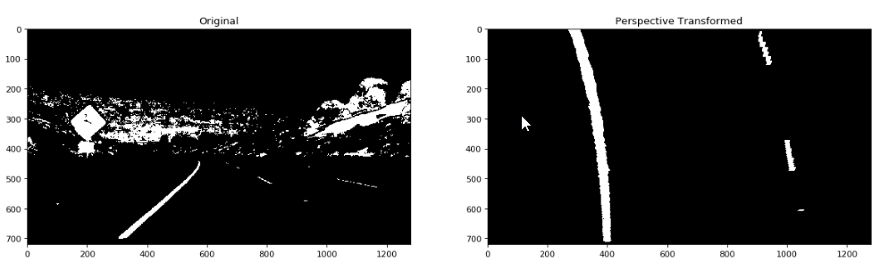

# Advanced Lane Finding Project

The goals / steps of this project are the following:

* Compute the camera calibration matrix and distortion coefficients given a set of chessboard images.
* Apply a distortion correction to raw images.
* Use color transforms, gradients, etc., to create a thresholded binary image.
* Apply a perspective transform to rectify binary image ("birds-eye view").
* Detect lane pixels and fit to find the lane boundary.
* Determine the curvature of the lane and vehicle position with respect to center.
* Warp the detected lane boundaries back onto the original image.
* Output visual display of the lane boundaries and numerical estimation of lane curvature and vehicle position.

## [Rubric](https://review.udacity.com/#!/rubrics/571/view) Points

### Here I will consider the rubric points individually and describe how I addressed each point in my implementation.

---

### Writeup / README

#### 1. Provide a Writeup / README that includes all the rubric points and how you addressed each one.  You can submit your writeup as markdown or pdf.  [Here](https://github.com/udacity/CarND-Advanced-Lane-Lines/blob/master/writeup_template.md) is a template writeup for this project you can use as a guide and a starting point.

You're reading it!

### Camera Calibration

#### 1. Briefly state how you computed the camera matrix and distortion coefficients. Provide an example of a distortion corrected calibration image.

The code for this step is contained in the 7th and 10th cells of the IPython notebook located in `AdvanceLaneFinding.ipynb`.

I start by preparing "object points", which will be the (x, y, z) coordinates of the chessboard corners in the world. Here I am assuming the chessboard is fixed on the (x, y) plane at z=0, such that the object points are the same for each calibration image.  Thus, `objp` is just a replicated array of coordinates, and `objpoints` will be appended with a copy of it every time I successfully detect all chessboard corners in a test image.  `imgpoints` will be appended with the (x, y) pixel position of each of the corners in the image plane with each successful chessboard detection.

I then used the output `objpoints` and `imgpoints` to compute the camera calibration and distortion coefficients using the `cv2.calibrateCamera` function.  I applied this distortion correction to the test image using the `cv2.undistort` function to straighten lines. I then used `cv2.getPerspectiveTransform` to obtain a perspective matrix to be used in `cv2.warpPerspective` and obtained this result:


## Pipeline

### 1. Provide an example of a distortion-corrected image.

Calling function `cv2.undistort` using the camera metric and distortion coefficients that previously calculated from the chessboard images to convert on a road image yield result below.


### 2. Describe how (and identify where in your code) you used color transforms, gradients or other methods to create a thresholded binary image.  Provide an example of a binary image result.

I used a combination of color and gradient thresholds to generate a binary image. The code can be found at the 16th cell in the Ipython notebook function `binaryThreshold`.  Here's an example of my output for this step.  (note: this is not actually from one of the test images)


### 3. Describe how (and identify where in your code) you performed a perspective transform and provide an example of a transformed image.

The code for my perspective transform is located at cell 21st in the ipython notebook. I hard coded the region of interest of the source to `[(200,720),(579,461),(709,461),(1100,720)])` which resemble the area shown below.


I then map it to `([(333,720),(333,0),(976,0),(976,720)])`
This resulted in the following source and destination points:

| Source        | Destination   |
|:-------------:|:-------------:|
| 200, 720      | 333, 720      |
| 579, 461      | 333, 0        |
| 709, 461      | 976, 0        |
| 1100, 720     | 976, 720      |

I verified that my perspective transform was working as expected by drawing the `src` and `dst` points onto a test image and its warped counterpart to verify that the lines appear parallel in the warped image.



### 4. Describe how (and identify where in your code) you identified lane-line pixels and fit their positions with a polynomial?

Then I find a lane-line by looking at the bird-eye-view image from the previous step. I then compute a histrogram by summing the active pixels in the 1/3 from the bottom along the x-axis. Then split them to left and right halve. I choose the x that has the most active pixels as a starting point(center point) to collect pixel that should be a lane line. Then if the pixel in this window greater than threshold this window is used as a part of the line. I then re-center the window for next level by averaging pixel in the current window. When collecting from bottom to top of the image. I fit degree 2 polynomial to points within search windows.


#### 5. Describe how (and identify where in your code) you calculated the radius of curvature of the lane and the position of the vehicle with respect to center.

The radius of the curvature is calculate using this formular: `((1 + (2*A*y + B)**2)**1.5) / np.absolute(2*A)` which is implemented in function `computeCurve` in 26th cell of ipython notebook. More in-depth explanation can be found [here](http://www.intmath.com/applications-differentiation/8-radius-curvature.php).

The position of the vehicle is made by using x-coordinate of left and right lines at y position 720 (bottom of the image) to compute the car current position. By making an assumption that the camera is mounted at the center of the car, such that the lane center is the midpoint at the bottom of the image between the two lines detected. The offset of the lane center from the center of the image (converted from pixels to meters) is the distance from the center of the lane. The code below can be found in cell 32rd of ipython notebook.

```python
# (3.7/700) == metre per pixel
offcenter = ((image.shape[1]/2) - ((L[0][719][0]+R[0][719][0])/2)) * (3.7/700)

```

#### 6. Provide an example image of your result plotted back down onto the road such that the lane area is identified clearly.

I implemented this step in a function `overlay` in the 30th cell.  Here is an example of my result on a test image:


---

### Pipeline (video)

#### 1. Provide a link to your final video output.  Your pipeline should perform reasonably well on the entire project video (wobbly lines are ok but no catastrophic failures that would cause the car to drive off the road!).

Here's a [link to my video result](result/1.mp4)

---

### Discussion

#### 1. Briefly discuss any problems / issues you faced in your implementation of this project.  Where will your pipeline likely fail?  What could you do to make it more robust?

One issue from this pipeline is the fact that the binary threshold cannot reliably produce a clear line in all conditions. When it fail either it detects the wrong line or not detecting at all. This can be improve by tuning parameters on calculating gradient and adjusting color threshold. Furthermore, it needs a better filtering step to remove unrelate pixels get into curvature computation step.

Lastly, this pipeline only look at the current road in front of the car. It should be a useful to look further down the road so it knows what is approaching. This will help in a situation where a lightning condition is suddenly changed or direct sunlight get into a camera.
